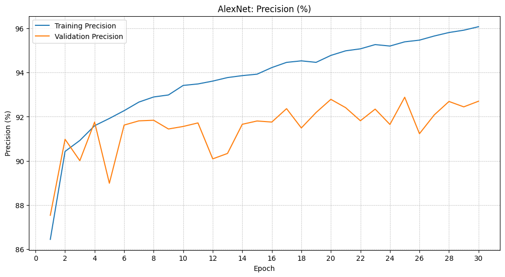

<h1> AlexNet </h1>

AlexNet is a pioneering convolutional neural network (CNN) architecture that revolutionized the field of computer vision. Developed by Alex Krizhevsky, Ilya Sutskever, and Geoffrey Hinton in 2012, it famously won the ImageNet Large Scale Visual Recognition Challenge (ILSVRC) by a significant margin, demonstrating the unprecedented power of deep learning for image classification.

The architecture of AlexNet is relatively deep for its time, consisting of eight layers: five convolutional layers followed by three fully connected layers. Its input is an RGB image, typically of size $227 \times 227 \times 3$.

Key architectural features and innovations of AlexNet include:

<li><b>ReLU Activation Function</b>: Unlike traditional sigmoid or tanh activation functions, AlexNet widely adopted Rectified Linear Units (ReLU). ReLU, defined as $f(x) = \max(0, x)$, helps address the vanishing gradient problem and significantly speeds up the training process of deep networks.</li> 

<li><b>GPU Parallelism</b>: To handle the computational demands of a deep network and a large dataset like ImageNet, AlexNet was designed to be split across two GPUs. This parallel processing greatly reduced training time.</li> 

<li><b>Local Response Normalization (LRN)</b>: Although less common in modern CNNs, AlexNet used LRN layers after the first two convolutional layers. These layers aimed to normalize the output of neurons, promoting competition among features and enhancing generalization.</li> 

<li><b>Overlapping Max Pooling</b>: Instead of non-overlapping pooling regions, AlexNet utilized overlapping max pooling, where the pooling window moves with a stride smaller than its size. This slightly improved accuracy and reduced overfitting.</li> 

<li><b>Dropout</b>: To combat overfitting in the highly parameterized fully connected layers, AlexNet introduced dropout. During training, a certain percentage of neurons (and their connections) are randomly "dropped out" (set to zero) in each forward and backward pass. This prevents co-adaptation of neurons and forces the network to learn more robust features.</li> 

<li><b>Data Augmentation</b>: To further reduce overfitting and increase the training data diversity, AlexNet employed on-the-fly data augmentation techniques such as random cropping, horizontal flipping, and varying RGB channel intensities.</li> 

AlexNet's success on ImageNet was a watershed moment, proving the efficacy of deep convolutional networks for large-scale image recognition and paving the way for subsequent, even deeper and more complex CNN architectures that continue to drive advancements in computer vision and artificial intelligence.

<h2><li> Dataset: Fashion MNIST </li></h2>
 
<h2> $$\color{yellow}\text{AlexNet architecture illustrating the layer-by-layer structure of the neural network model.}$$ </h2>

<h2> $$\color{yellow}\text{Neural-Net architecture}$$ </h2>

<h2> $$\color{yellow}\text{Metric Plots for AlexNet Training}$$ </h2>
<!--head>
    <meta charset="UTF-8">
    <meta name="viewport" content="width=device-width, initial-scale=1.0">
    <title> Accuracy Evolution </title>
    
</head-->
<body>   
     <h2> Accuracy Evolution </h2>
     <a href='https://postimages.org/' target='_blank'>
     <!--img src='https://i.postimg.cc/3NRBHJTG/accuracy-alexnet-30epochs.png' border='0' alt='accuracy-alexnet-30epochs'/></a-->
     </a>
    
<h2> Precision Evolution </h2>
<a href='https://postimages.org/' target='_blank'>
    <!--img src='https://i.postimg.cc/6QBssvS5/precision-30epochs-alexnet.png' border='0' alt='precision-30epochs-alexnet'/-->
    
</a>
 

<h2> Training/Validation Loss Evolution </h2>
<a href='https://postimages.org/' target='_blank'>
     <!--img src='https://i.postimg.cc/cJ0fS47J/losses-alexnet-30epochs.png' border='0' alt='losses-alexnet-30epochs'/-->
     
</a>
</body>
